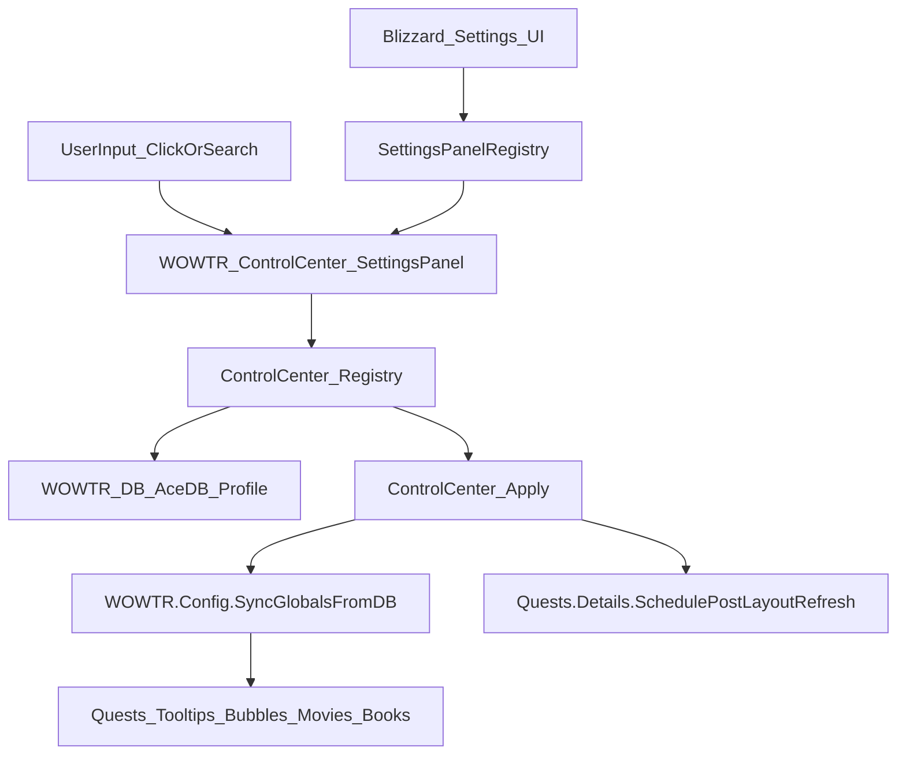

#Port Plumber ControlCenter Options Panel into WoWLang

## Goal

Build **the same Plumber ControlCenter options panel UX** (layout, widgets, search/filter, preview pane, tabs, dropdown menus, scrollbar feel, Escape behavior) as **our primary settings UI**, and **stop using AceConfig UI for options presentation**. Persist settings via **AceDB (existing `WOWTR_DB`)** and apply changes via existing runtime hooks/helpers.

## Constraints (from project rules/lessons)

- **No Blizzard “force refresh” calls** for quest frames; must use **post-layout reapply** patterns (see `common/Quests/Details.lua`’s `Quests.Details.SchedulePostLayoutRefresh()`).
- **AceDB remains the durable config store** (keep migration one-time).
- **No duplicated hooks/parallel subsystems**: settings UI must call existing config sync/apply helpers, not invent a second state model.

## What Plumber’s panel actually is (parts + responsibilities)

### Primary UI (what you’re calling “the amazing options panel”)

- **Layout + templates**: [`Docs/Plumber/Modules/ControlCenter/ControlCenter.xml`](Docs/Plumber/Modules/ControlCenter/ControlCenter.xml)
- Defines virtual templates used by the panel:
    - `PlumberSettingsPanelLayoutTemplate` (FrameContainer + Left/Central/Right sections + tabs)
    - `PlumberEditBoxArtTemplate` (search box)
    - `PlumberTabButtonTemplate` (tab buttons)
    - `PlumberSquareButtonArtTemplate` (square icon buttons, e.g. filter/menu)
    - `PlumberSettingsPanelEntryTemplate` (toggle entry row with optional settings button)
    - `PlumberSettingsPanelHeaderTemplate` (category header rows)
    - plus selection/highlight templates.
- **Main implementation (Retail 11.0+)**: [`Docs/Plumber/Modules/ControlCenter/SettingsPanelNew.lua`](Docs/Plumber/Modules/ControlCenter/SettingsPanelNew.lua)
- Builds the full UI from the templates:
    - **Left panel**: search box + filter dropdown button + category list (with fade and “new” dot)
    - **Center panel**: virtualized scrolling list of headers + entries
    - **Right panel**: preview image masked + description text
    - **Tabs**: “Modules” and “Release Notes”
    - **Minimize behavior** when a module opens a movable options dialog
- **Legacy panel (older clients)**: [`Docs/Plumber/Modules/ControlCenter/SettingsPanel.lua`](Docs/Plumber/Modules/ControlCenter/SettingsPanel.lua)
- Not needed for WoWAR (our interface is ≥ 110205), but it’s useful as reference.

### Integration into Blizzard Settings + Escape + AddOnCompartment

- **Settings registration + standalone toggle**: [`Docs/Plumber/Modules/ControlCenter/SettingsPanelRegistry.lua`](Docs/Plumber/Modules/ControlCenter/SettingsPanelRegistry.lua)
- Registers a canvas category via `Settings.RegisterCanvasLayoutCategory`.
- Reparents the panel into the Blizzard settings canvas on show.
- Adds an **Escape close dummy** into `UISpecialFrames`.
- Registers **AddOnCompartment** entry and a **slash command**.

### Data model for the panel (module registry, sorting, search, “new feature” markers)

- **Module registry + sorting/search**: [`Docs/Plumber/Modules/ControlCenter/PreLoad.lua`](Docs/Plumber/Modules/ControlCenter/PreLoad.lua)
- Builds a `ControlCenter.modules` list, grouped and sorted.
- Computes “new feature” markers via `settingsOpenTime` + `moduleAddedTime` and `seenNewFeatureMark`.

### UI infrastructure the panel depends on (not in ControlCenter folder)

- **Virtualized ScrollView** (used by the center list + changelog list):
- [`Docs/Plumber/Modules/ExpansionLandingPage/ScrollView.lua`](Docs/Plumber/Modules/ExpansionLandingPage/ScrollView.lua) → exports `API.CreateScrollView()`.
- **ControlCenter scrollbar** (used by the panel):
- [`Docs/Plumber/Modules/ControlCenter/ScrollBar.lua`](Docs/Plumber/Modules/ControlCenter/ScrollBar.lua) → exports `ControlCenter.CreateScrollBarWithDynamicSize()`.
- **Dropdown menus, object pools, themed border, red button, UI sounds**:
- [`Docs/Plumber/Modules/ExpansionLandingPage/Basic.lua`](Docs/Plumber/Modules/ExpansionLandingPage/Basic.lua) → exports `addon.LandingPageUtil.*`.
- **Common widgets + utility helpers** used by module option dialogs and texture behavior:
- [`Docs/Plumber/Modules/SharedWidgets.lua`](Docs/Plumber/Modules/SharedWidgets.lua) + [`Docs/Plumber/Modules/SharedWidgets.xml`](Docs/Plumber/Modules/SharedWidgets.xml)
- Provides:
    - `API.DisableSharpening`, `API.CreateThreeSliceTextures`, nine-slice helpers
    - `addon.CreateCheckbox`, `addon.CreateSlider`, `addon.CreateUIPanelButton`, etc.
    - `addon.SetupSettingsDialog` / `addon.ToggleSettingsDialog` (movable per-module settings pop-up)
- **Release notes helpers**:
- [`Docs/Plumber/Modules/ControlCenter/Redactor.lua`](Docs/Plumber/Modules/ControlCenter/Redactor.lua) for the redaction effect.
- **Fonts**:
- [`Docs/Plumber/Modules/SharedFonts.xml`](Docs/Plumber/Modules/SharedFonts.xml) defines `PlumberFont_16` used by the ScrollView “no results” text.

## Plumber assets used by the panel (exact list)

### ControlCenter art (copy these 1:1)

From [`Docs/Plumber/Art/ControlCenter`](Docs/Plumber/Art/ControlCenter):

- **Core UI textures**
- `SettingsPanel.png` (main sprite sheet)
- `SettingsPanelWidget.png` (used by legacy panel; safe to include)
- `SettingsPanelBackground.jpg`
- `OptionEntryHighlight.png`
- `NewFeatureTag.tga`
- `NewFeatureTooltipIcon.tga`
- `PreviewMask.tga`
- `CollapseExpand.tga`
- `SelectionTexture.jpg`
- **Preview images (Plumber’s set; we’ll replace/extend with WoWLang previews later)**
- All `Preview_*.jpg` files currently in that folder (see listing in repo).

### ExpansionLandingPage art (required because SettingsPanelNew depends on LandingPageUtil + ScrollView)

From [`Docs/Plumber/Art/ExpansionLandingPage`](Docs/Plumber/Art/ExpansionLandingPage):

- `ExpansionBorder_TWW.tga` (outer border + buttons/scroll pieces)
- `DropdownMenu.tga` (dropdown menu chrome)
- `HorizontalButtonHighlight.tga`
- `Divider-H-Shadow.tga` (used by some menu/list widgets)
- `ChecklistButton.tga` / `StatusBar*.tga` / icons subfolder (safe to copy whole directory to avoid missing a hard dependency).

### SharedWidgets art (required if we use Plumber-style pop-up dialogs for non-boolean options)

- From [`Docs/Plumber/Art/Button`](Docs/Plumber/Art/Button) (minimum for our options dialogs):
- `Checkbox.tga`
- `CloseButton.tga`
- `UIPanelButton.tga`
- From [`Docs/Plumber/Art/Frame`](Docs/Plumber/Art/Frame) (minimum for slider/dialog styling):
- `Slider.tga`
- `Divider_Gradient_Horizontal.tga`
- `Divider_NineSlice.tga` (used by dialog divider)
- `EditModeHighlighted.blp` (used by selection overlay in some widgets)

## Our current options system (what we’re replacing)

- **Persistence**: [`common/Config/Core.lua`](common/Config/Core.lua) initializes **AceDB** (`WOWTR_DB`) and migrates legacy config.
- **UI presentation today**: AceConfig tabs assembled in `common/Config/Tabs/*` and registered via `AceConfigDialog:AddToBlizOptions`.
- **Entrypoints**:
- `/wowtr` calls `WOWTR.Config.Open()` (`common/Config/Main.lua`).
- Minimap icon opens config (`common/Config/Minimap.lua`).

## Implementation plan (SUPER detailed)

### Phase 0 — Decide where the new UI lives (repo layout)

We will implement WoWLang’s new options UI under a dedicated folder so it stays modular:

- Add new folder: [`common/Config/ControlCenter`](common/Config/ControlCenter)
- Add new assets folder inside the addon folder:
- For WoWAR: [`WoWAR/Images/ControlCenter`](WoWAR/Images/ControlCenter)
- Also copy required dependencies into:
    - [`WoWAR/Images/ExpansionLandingPage`](WoWAR/Images/ExpansionLandingPage)
    - [`WoWAR/Images/PlumberUI/Button`](WoWAR/Images/PlumberUI/Button)
    - [`WoWAR/Images/PlumberUI/Frame`](WoWAR/Images/PlumberUI/Frame)

(Exact folder names can be tweaked, but the plan assumes we **do not** leave anything under `Docs/Plumber` for runtime.)

### Phase 1 — Port the panel skeleton (templates + main frame) with safe renaming

**Why:** We must avoid collisions if the user also runs the Plumber addon.

- Create [`common/Config/ControlCenter/Templates.xml`](common/Config/ControlCenter/Templates.xml)
- Copy relevant templates from `Docs/Plumber/Modules/ControlCenter/ControlCenter.xml`.
- Rename every `Plumber*` template/frame to `WOWTR_*` or `WoWLang*`:
    - `PlumberSettingsPanelLayoutTemplate` → `WOWTR_SettingsPanelLayoutTemplate`
    - `PlumberEditBoxArtTemplate` → `WOWTR_EditBoxArtTemplate`
    - `PlumberTabButtonTemplate` → `WOWTR_TabButtonTemplate`
    - `PlumberSquareButtonArtTemplate` → `WOWTR_SquareButtonArtTemplate`
    - `PlumberSettingsPanelEntryTemplate` → `WOWTR_SettingsPanelEntryTemplate`
    - `PlumberSettingsPanelHeaderTemplate` → `WOWTR_SettingsPanelHeaderTemplate`
- Update `<Script file=...>` includes to point to our new lua files.
- Create [`common/Config/ControlCenter/SettingsPanel.lua`](common/Config/ControlCenter/SettingsPanel.lua)
- Port `SettingsPanelNew.lua` logic and rename:
    - Frame name/type to `WOWTR_ControlCenter_SettingsPanel` (no “Plumber”).
    - Replace texture roots:
    - `Interface/AddOns/Plumber/Art/ControlCenter/...` → `WoWTR_Localization.mainFolder .. "\\Images\\ControlCenter\\..."`
    - `Interface/AddOns/Plumber/Art/ExpansionLandingPage/...` → `WoWTR_Localization.mainFolder .. "\\Images\\ExpansionLandingPage\\..."`
- Keep the same UX primitives:
    - SearchBox debounce, category fade, highlight, new markers, tab buttons.
    - Center list built via ScrollView `SetContent()`.

### Phase 2 — Port required UI infrastructure (minimal subset)

To keep WoWLang modular and avoid importing all of Plumber, we’ll extract only what the settings panel needs:

- Add [`common/Config/ControlCenter/Util.lua`](common/Config/ControlCenter/Util.lua)
- Port **only** these from `Docs/Plumber/Modules/ExpansionLandingPage/Basic.lua`:
    - `CreateObjectPool`
    - `PlayUISound`
    - Dropdown menu system used by filter button (`LandingPageUtil.DropdownMenu`)
    - `CreateExpansionThemeFrame` (outer border)
    - `CreateRedButton` (used by minimized return button)
- Add [`common/Config/ControlCenter/ScrollView.lua`](common/Config/ControlCenter/ScrollView.lua)
- Port `API.CreateScrollView` and `ScrollViewMixin` from `Docs/Plumber/Modules/ExpansionLandingPage/ScrollView.lua`.
- Ensure it’s namespaced under `WOWTR.Config.ControlCenter` to avoid globals.
- Add [`common/Config/ControlCenter/ScrollBar.lua`](common/Config/ControlCenter/ScrollBar.lua)
- Port `ControlCenter.CreateScrollBarWithDynamicSize` from `Docs/Plumber/Modules/ControlCenter/ScrollBar.lua`.
- Update its texture path to our copied textures.

### Phase 3 — Build WoWLang module registry (mapping our settings to “modules”)

We will create a registry similar to Plumber’s `ControlCenter.modules`, but backed by AceDB.

- Add [`common/Config/ControlCenter/Registry.lua`](common/Config/ControlCenter/Registry.lua)
- Define:
    - `GetSetting(path)` / `SetSetting(path, value)` where `path` is a dotted key like `"quests.active"`.
    - `GetBool(path)` / `FlipBool(path)`.
- Define a list of **module entries** that power the UI list:
    - Example (quests):
    - Parent entry: `quests.active` (master)
    - Sub options: `quests.transtitle`, `quests.gossip`, `quests.tracker`, `quests.ownnames`, `quests.en_first`, `quests.saveQS`, `quests.saveGS`, `quests.immersion`, `quests.storyline`, `quests.questlog`, `quests.dialogueui`
    - Optional settings button: opens a dialog for `quests.fontsize` + `quests.FontLSM`.
    - Similar for `tooltips`, `bubbles`, `movies`, `books`, `chatAR`, `minimap.hide`, etc.
- Implement category grouping to match our old tabs (General/Tooltips/Bubbles/Movies/Books/Chat/About), but using the Plumber visual style.

### Phase 4 — Replace AceConfig UI with our panel (keep AceDB)

- Update [`common/Config/Core.lua`](common/Config/Core.lua)
- Keep AceDB init + legacy migration.
- **Remove/disable**:
    - `AceConfig:RegisterOptionsTable("WOWTR", ...)`
    - `AceConfigDialog:AddToBlizOptions("WOWTR", ...)`
- Replace `WOWTR.Config.Open()` to open our new panel.
- Update [`common/Config/Minimap.lua`](common/Config/Minimap.lua)
- Change `OpenConfig()` to open our new panel.
- Update [`common/Config/Main.lua`](common/Config/Main.lua)
- Keep slash command entrypoint, but route into new panel.

### Phase 5 — Apply settings safely (no forbidden refreshes)

We will centralize “apply” so every toggle has immediate effect without calling Blizzard rebuild APIs.

- Add [`common/Config/ControlCenter/Apply.lua`](common/Config/ControlCenter/Apply.lua)
- After any `SetSetting(...)`:
    - Call `WOWTR.Config.SyncGlobalsFromDB()`.
    - For quest-related toggles that affect QuestMapFrame: call `ns.Quests.Details.SchedulePostLayoutRefresh()`.
    - Avoid `QuestMapFrame_ShowQuestDetails` (per lessons).

### Phase 6 — Settings registration inside Blizzard Settings + Escape behavior

- Add [`common/Config/ControlCenter/SettingsPanelRegistry.lua`](common/Config/ControlCenter/SettingsPanelRegistry.lua)
- Port logic from Plumber’s `SettingsPanelRegistry.lua`:
    - `Settings.RegisterCanvasLayoutCategory(BlizzardPanel, <OurTitle>)`
    - Reparent panel on `OnShow`
    - Escape-close dummy frame added to `UISpecialFrames`
    - Optional: AddOnCompartment integration (we already have minimap icon; this is a bonus)

### Phase 7 — Copy assets + create WoWLang previews

- Copy folders/files (from `Docs/Plumber/Art/...`) into WoWAR runtime paths described above.
- Create new preview images for WoWLang features:
- `Preview_quests.jpg`, `Preview_tooltips.jpg`, `Preview_bubbles.jpg`, etc.
- Wire `ShowFeaturePreview()` to those preview IDs.
- Interim: reuse existing `WoWAR/Images/*_mini.jpg` as placeholders.

### Phase 8 — Wire TOC load order

- Update [`WoWAR/WoWAR.toc`](WoWAR/WoWAR.toc)
- Add our new XML + Lua files in a safe order:
    - Templates/XML first
    - Util/ScrollView/ScrollBar
    - Registry/Apply
    - SettingsPanel
    - Registry integration
- Remove (or comment out) AceConfig tab lua includes once the new panel is complete.

### Phase 9 — Localization + Arabic font integration

- Add new UI strings (tab names, filter menu headers, etc) to `WoWTR_Config_Interface` (e.g., in [`WoWAR/WoW_Localization_AR.lua`](WoWAR/WoW_Localization_AR.lua)), and use `WOWTR.Config.Label()` to fetch them.
- On panel show, call `WOWTR.Fonts.Apply(MainFrame)` so Arabic renders correctly.

### Phase 10 — Validation checklist (in-game)

- Open via:
- Blizzard Settings → AddOns → our category
- minimap icon click
- `/wowtr`
- Verify:
- Search returns results and hides non-matching categories.
- Toggling settings updates `WOWTR_DB` and applies immediately.
- QuestMapFrame translations never require Blizzard refresh calls; post-layout ticker handles reapply.
- Escape closes standalone panel.

### Phase 11 — Project memory updates

- Append an entry to [`.cursor/memory/journal.md`](.cursor/memory/journal.md) describing what changed + key files.
- If we uncover any non-obvious issue while porting (e.g., a WoW texture format gotcha, Settings API behavior change), add a new entry to [`.cursor/memory/lessons.md`](.cursor/memory/lessons.md).

## Architecture/data-flow diagram

## Key files we will touch

- Replace UI: