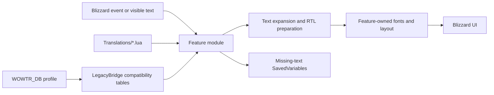

# WoWAR Architecture

> Status: Maintained
>
> Audience: Contributors changing runtime Lua, translations, configuration, or UI integration
>
> Last verified against the working tree: 2026-07-31

## System Overview

WoWAR is a World of Warcraft addon loaded directly by the game client. There is no normal compile or bundle step: [`WoWAR.toc`](../WoWAR.toc) is the executable dependency graph, and its ordering is part of the architecture.

At runtime, feature modules receive Blizzard UI text or events, look up Arabic translations, expand project placeholders, prepare the text for Arabic display, apply feature-owned UI layout, and optionally save missing source text for later translation.

## Load Order

The manifest currently loads the runtime in these broad stages:

1. Embedded libraries.
2. Translation data and Arabic locale data.
3. Core state, debug facilities, compatibility, events, and hook helpers.
4. Shared fonts and configuration.
5. Tooltip and general UI translation modules.
6. Arabic reshaping, direction helpers, and quest modules.
7. The public text pipeline in [`common/Text.lua`](../common/Text.lua).
8. Bubbles, movies, tutorials, books, chat, optional integrations, and remaining UI modules.

Consequences:

- A function used during file evaluation must already be loaded by the manifest.
- Some UI metadata is intentionally stored as raw text because `QTR_ReverseIfAR` is exported later. Shape it when the widget renders.
- Optional Blizzard frames and third-party addon frames may not exist at file-load time. Discover or hook them when their owning UI is available.
- If a new file is added, place it deliberately in `WoWAR.toc` and document any load-order dependency in the code.

## Runtime Namespaces

- `WOWTR` is the public addon table used by configuration, fonts, debug facilities, and compatibility entry points.
- The private addon namespace from `local addonName, ns = ...` owns modular runtime services such as `ns.RTL`, `ns.Core`, and quest modules.
- `WOWTR_Localization` and `WOWTR_Config_Interface` are the primary localization globals. `WoWTR_*` spellings are compatibility aliases only.
- Legacy globals such as `QTR_PS`, `TT_PS`, `ST_PM`, `BB_PM`, `MF_PM`, `BT_PM`, and `CH_PM` remain compatibility surfaces. Do not add a second mapping system for them.
- Legacy `ST_*` function exports belong in [`common/Core/Compat.lua`](../common/Core/Compat.lua). New implementation should prefer owned module APIs with thin global wrappers only where compatibility requires them.

## Subsystem Ownership

| Concern | Owning code |
| --- | --- |
| Bootstrap, events, compatibility, shared hook helpers | [`common/Core`](../common/Core) |
| AceDB defaults, migration, synchronization | [`common/Config/Core.lua`](../common/Config/Core.lua), [`common/Core/LegacyBridge.lua`](../common/Core/LegacyBridge.lua) |
| User-facing settings | [`common/Config/ControlCenter`](../common/Config/ControlCenter) |
| Arabic font registration and application | [`common/UI/Fonts.lua`](../common/UI/Fonts.lua) |
| Direction detection and shared alignment helpers | [`common/RTL.lua`](../common/RTL.lua) |
| Placeholder expansion and display-time text preparation | [`common/Text.lua`](../common/Text.lua) |
| Arabic shaping and width-aware visual line preparation | [`common/Text/Reshaper.lua`](../common/Text/Reshaper.lua) |
| Quest, gossip, tracker, and reward layout | [`common/Quests`](../common/Quests) |
| Tooltip hooks, capture, font templates, and tooltip layout | [`common/Tooltips`](../common/Tooltips) |
| Data-driven Blizzard UI translation | [`common/UI/Translate.lua`](../common/UI/Translate.lua) and feature files in [`common/UI`](../common/UI) |
| Bubbles, movies, tutorials, books, and Arabic chat | Their matching directories under [`common`](../common) |
| Immersion, Storyline, DialogueUI, and Classic Quest Log adapters | [`common/Plugins`](../common/Plugins) |

Ownership matters: add behavior to the existing owner instead of registering a competing hook or font pass elsewhere.

## Configuration and Persistent State

`WOWTR_DB`, managed by AceDB, is the durable source of truth for user configuration. Many older runtime paths still read legacy tables. [`common/Core/LegacyBridge.lua`](../common/Core/LegacyBridge.lua) is the single table-driven mapping between the two representations.

On startup:

1. [`common/Config/Core.lua`](../common/Config/Core.lua) checks whether `WOWTR_DB` already exists.
2. AceDB creates or opens the profile.
3. Legacy values migrate into the profile only when the AceDB SavedVariables table did not already exist.
4. The profile is synchronized back to the legacy runtime tables.
5. Profile change, copy, and reset callbacks repeat the profile-to-legacy synchronization.

Feature capture data is stored separately in SavedVariables declared by `WoWAR.toc`, including quest, gossip, bubble, subtitle, tutorial, tooltip, book, and UI-string collections. Treat all persisted data as untrusted: type-check it and apply defaults before use.

See [Configuration Architecture and Settings Reference](ConfigSettingsAudit.md) for the complete contract.

## Translation and Rendering Flow

The exact lookup differs by feature, but the stable flow is:

1. Capture the original Blizzard text or an event identifier.
2. Resolve a translated entry from the feature's translation table.
3. Expand player, gender, race, class, name, newline, and other project placeholders.
4. If the result contains Arabic and the target supports it, protect WoW markup and prepare the visible text through the RTL pipeline.
5. Apply the Arabic font, justification, width, and any targeted anchor changes owned by that feature.
6. If no translation exists, preserve the original LTR presentation and optionally save the missing source text.

Fallback must not manufacture a mixed state. In particular, quest headers and RTL layout are enabled only when real Arabic quest data exists; an English fallback restores the original headers, font, and LTR layout without changing the user's translation toggle.

See [Arabic Text Rendering](QTR_ExpandUnitInfo_RTL_Bidi_Implementation_Prompt.md) for the text contract.

## Hook and Refresh Model

- Hooks must be idempotent and have one clear owner.
- Prefer shared facilities in [`common/Core/HookUtils.lua`](../common/Core/HookUtils.lua).
- Avoid unbounded `OnUpdate` work; use events or clamped, deduplicated timers.
- QuestMapFrame translation is applied after Blizzard layout completes. Setting changes schedule the existing post-layout refresh.
- Do not call Blizzard force-refresh APIs from translation toggles. Disabling a feature should restore owned visible state and let normal UI events perform the next render.
- Every RTL layout mutation needs an explicit LTR/off reset path.

## Documentation Authority

When documentation and code disagree:

1. Verify current behavior in the code and `WoWAR.toc`.
2. Confirm visible behavior in the WoW client when the question is UI- or timing-dependent.
3. Fix the documentation in the same change.

Git history explains how the project arrived at the current design. Maintained docs describe the current design only.
