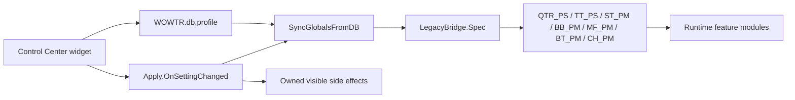

# Configuration Architecture and Settings Reference

> Status: Maintained reference
>
> Scope: AceDB profiles, legacy runtime tables, Control Center registration, and setting side effects
>
> Last verified against the working tree: 2026-07-31

The filename is retained for existing links, but this is a current architecture reference rather than a historical audit.

## Sources of Truth

| Responsibility | Authoritative file |
| --- | --- |
| Profile defaults and AceDB lifecycle | [`common/Config/Core.lua`](../common/Config/Core.lua) |
| Profile-to-legacy mappings and type conversion | [`common/Core/LegacyBridge.lua`](../common/Core/LegacyBridge.lua) |
| Control Center modules and setting bindings | [`common/Config/ControlCenter/Registry.lua`](../common/Config/ControlCenter/Registry.lua) |
| Immediate runtime side effects | [`common/Config/ControlCenter/Apply.lua`](../common/Config/ControlCenter/Apply.lua) |
| Blizzard Settings and standalone panel integration | [`common/Config/ControlCenter/SettingsPanelRegistry.lua`](../common/Config/ControlCenter/SettingsPanelRegistry.lua) |
| Minimap icon registration and visibility | [`common/Config/Minimap.lua`](../common/Config/Minimap.lua) |

`WOWTR_DB` is the durable source of truth. Legacy tables remain runtime compatibility views because feature modules still read them.

The `WOWTR_*` `dbKey` values in the Control Center are stable UI identifiers used for lookup and apply routing. They are not SavedVariables paths.

## Initialization and Migration

[`WOWTR.Config.Init`](../common/Config/Core.lua) follows this lifecycle:

1. Check whether the global `WOWTR_DB` table already exists.
2. Open or create `WOWTR_DB` through AceDB with `C.defaults`.
3. If `WOWTR_DB` did not exist, migrate legacy tables into the new profile.
4. Normalize mutually exclusive bubble chat values.
5. Synchronize the profile back into all legacy runtime tables.
6. Register profile change, copy, and reset callbacks that repeat synchronization.
7. Initialize debug configuration and shared fonts.

The presence of `WOWTR_DB`, captured before calling `AceDB:New`, is the migration gate. `WOWTR.db.global.legacyMigrated` is informational; it is not the condition that protects an existing profile from being overwritten.

## Representation Rules

- Profile booleans are Lua `true` or `false`.
- Most legacy booleans are strings: `"1"` or `"0"`.
- Several legacy numeric settings are stored as strings for compatibility.
- `minimap.hide` is inverted when mapped to `QTR_PS.icon` and the visible Control Center setting.
- The Arabic chat legacy table is synchronized only when the active localization is Arabic.
- If both `bubbles.chat_en` and `bubbles.chat_tr` are true, normalization keeps translated output and sets `chat_en` to false.

Never duplicate these conversions at individual call sites. Add or change a row in `LegacyBridge.Spec`.

## Control Center Mappings

### Quests and Minimap

| Control Center `dbKey` | Profile path | Legacy view |
| --- | --- | --- |
| `WOWTR_Quests` | `quests.active` | `QTR_PS.active` |
| `WOWTR_Quests_Transtitle` | `quests.transtitle` | `QTR_PS.transtitle` |
| `WOWTR_Quests_Gossip` | `quests.gossip` | `QTR_PS.gossip` |
| `WOWTR_Quests_Tracker` | `quests.tracker` | `QTR_PS.tracker` |
| `WOWTR_Quests_OwnNames` | `quests.ownnames` | `QTR_PS.ownnames` |
| `WOWTR_Quests_ENFirst` | `quests.en_first` | `QTR_PS.en_first` |
| `WOWTR_Quests_SaveQS` | `quests.saveQS` | `QTR_PS.saveQS` |
| `WOWTR_Quests_SaveGS` | `quests.saveGS` | `QTR_PS.saveGS` |
| `WOWTR_Quests_Immersion` | `quests.immersion` | `QTR_PS.immersion` |
| `WOWTR_Quests_Storyline` | `quests.storyline` | `QTR_PS.storyline` |
| `WOWTR_Quests_QuestLog` | `quests.questlog` | `QTR_PS.questlog` |
| `WOWTR_Quests_DialogueUI` | `quests.dialogueui` | `QTR_PS.dialogueui` |
| `WOWTR_Minimap_ShowIcon` | visible state is `not minimap.hide` | `QTR_PS.icon` is the same visible state |

The four integration flags gate their matching adapters under [`common/Plugins`](../common/Plugins).

### Tooltips, Tutorials, and Blizzard UI

| Control Center `dbKey` | Profile path | Legacy view |
| --- | --- | --- |
| `WOWTR_Tooltips` | `tooltips.active` | `TT_PS.active` and `ST_PM.active` |
| `WOWTR_Tooltips_Always` | `tooltips.constantly` | `ST_PM.constantly` |
| `WOWTR_Tooltips_SaveUI` | `tooltips.saveui` | `TT_PS.saveui` |
| `WOWTR_Tooltips_UI1` | `tooltips.ui1` | `TT_PS.ui1` |
| `WOWTR_Tooltips_UI2` | `tooltips.ui2` | `TT_PS.ui2` |
| `WOWTR_Tooltips_UI3` | `tooltips.ui3` | `TT_PS.ui3` |
| `WOWTR_Tooltips_UI4` | `tooltips.ui4` | `TT_PS.ui4` |
| `WOWTR_Tooltips_UI5` | `tooltips.ui5` | `TT_PS.ui5` |
| `WOWTR_Tooltips_UI6` | `tooltips.ui6` | `TT_PS.ui6` |
| `WOWTR_Tooltips_UI7` | `tooltips.ui7` | `TT_PS.ui7` |
| `WOWTR_Tooltips_UI8` | `tooltips.ui8` | `TT_PS.ui8` |
| `WOWTR_Tooltips_UITalents` | `tooltips.ui_talents` | `TT_PS.ui_talents` |
| `WOWTR_Tooltips_Item` | `tooltips.item` | `ST_PM.item` |
| `WOWTR_Tooltips_Spell` | `tooltips.spell` | `ST_PM.spell` |
| `WOWTR_Tooltips_Talent` | `tooltips.talent` | `ST_PM.talent` |
| `WOWTR_Tooltips_Title` | `tooltips.transtitle` | `ST_PM.transtitle` |
| `WOWTR_Tooltips_SaveTutorials` | `tooltips.save` | `TT_PS.save` |
| `WOWTR_Tooltips_ShowID` | `tooltips.showID` | `ST_PM.showID` |
| `WOWTR_Tooltips_ShowHash` | `tooltips.showHS` | `ST_PM.showHS` |
| `WOWTR_Tooltips_HideSellPrice` | `tooltips.sellprice` | `ST_PM.sellprice` |
| `WOWTR_Tooltips_SaveNW` | `tooltips.saveNW` | `ST_PM.saveNW` |

The `ui1` through `ui8` flags gate groups of Blizzard UI translation patches. The exact visible labels are defined by the Control Center registry and locale data; the profile paths are the stable API.

### Bubbles

| Control Center `dbKey` | Profile path | Legacy view |
| --- | --- | --- |
| `WOWTR_Bubbles` | `bubbles.active` | `BB_PM.active` |
| `WOWTR_Bubbles_ChatTR` | `bubbles.chat_tr` | `BB_PM["chat-tr"]` |
| `WOWTR_Bubbles_ChatEN` | `bubbles.chat_en` | `BB_PM["chat-en"]` |
| `WOWTR_Bubbles_SaveNB` | `bubbles.saveNB` | `BB_PM.saveNB` |
| `WOWTR_Bubbles_SetSize` | `bubbles.setsize` | `BB_PM.setsize` |
| `WOWTR_Bubbles_Dungeon` | `bubbles.dungeon` | `BB_PM.dungeon` |

### Movies and Subtitles

| Control Center `dbKey` | Profile path | Legacy view |
| --- | --- | --- |
| `WOWTR_Movies` | `movies.active` | `MF_PM.active` |
| `WOWTR_Movies_Intro` | `movies.intro` | `MF_PM.intro` |
| `WOWTR_Movies_Movie` | `movies.movie` | `MF_PM.movie` |
| `WOWTR_Movies_Cinematic` | `movies.cinematic` | `MF_PM.cinematic` |
| `WOWTR_Movies_Save` | `movies.save` | `MF_PM.save` |

### Books

| Control Center `dbKey` | Profile path | Legacy view |
| --- | --- | --- |
| `WOWTR_Books` | `books.active` | `BT_PM.active` |
| `WOWTR_Books_Title` | `books.title` | `BT_PM.title` |
| `WOWTR_Books_ShowID` | `books.showID` | `BT_PM.showID` |
| `WOWTR_Books_SetSize` | `books.setsize` | `BT_PM.setsize` |
| `WOWTR_Books_SaveNW` | `books.saveNW` | `BT_PM.saveNW` |

### Arabic Chat

| Control Center `dbKey` | Profile path | Legacy view |
| --- | --- | --- |
| `WOWTR_ChatAR` | `chatAR.active` | `CH_PM.active` |
| `WOWTR_ChatAR_SetSize` | `chatAR.setsize` | `CH_PM.setsize` |

`WOWTR_About` is a virtual Control Center module and has no profile value.

## Persisted Settings Not Exposed by the Current Control Center

These values exist in defaults and/or `LegacyBridge.Spec`, but the current registry has no editing widget for them:

| Profile path | Compatibility or runtime destination |
| --- | --- |
| `quests.FontFile` | `QTR_PS.FontFile`; also used to resolve `WOWTR_Font2` |
| `quests.FontLSM` | Resolved through LibSharedMedia to `WOWTR_Font1` and `WOWTR_Font2` |
| `quests.fontsize` | `QTR_PS.fontsize` |
| `tooltips.timer` | `ST_PM.timer` |
| `bubbles.fontsize` | `BB_PM.fontsize` |
| `bubbles.sex` | `BB_PM.sex` |
| `bubbles.timeDisplay` | `BB_PM.timeDisplay` |
| `bubbles.dungeonF1` ... `dungeonF5` | `BB_PM.dungeonF1` ... `dungeonF5` |
| `books.fontsize` | `BT_PM.fontsize` |
| `chatAR.fontsize` | `CH_PM.fontsize` in Arabic localization |

Do not assume “not visible in Control Center” means “unused” or safe to remove. Search runtime consumers and migration behavior first.

## Runtime Apply Behavior

Every Control Center mutation writes the profile, then calls `Apply.OnSettingChanged` through the module's toggle callback.

The apply layer:

- always synchronizes profile values to legacy tables;
- schedules the existing post-layout quest refresh for quest settings;
- immediately restores translated quest/gossip UI when the master quest setting is disabled, without invoking Blizzard force-refresh APIs;
- hides the current `GameTooltip` after tooltip setting changes so its next show uses the new rules.

The minimap setting has a dedicated callback because the profile stores `hide` while the UI presents “Show icon.” It synchronizes state and calls LibDBIcon `Show` or `Hide`.

Other features read the synchronized values on their next normal event or render.

## Adding or Changing a Setting

1. Add or change the default in `C.defaults.profile`.
2. Add or update the `LegacyBridge.Spec` row if any runtime or older install uses a legacy value.
3. Register the user-facing widget in `ControlCenter/Registry.lua` if it should be editable.
4. Add localized label and description keys with a plain fallback.
5. Add only the immediate side effect that the owning UI requires; prefer normal feature events for the next render.
6. Verify new install, existing install, profile copy/change/reset, `/reload`, and both boolean states.
7. Update this mapping and the configuration section of [Regression Testing](RegressionTesting.md).

When removing a setting, preserve or explicitly migrate old SavedVariables until compatibility is intentionally ended.

## Common Failure Modes

- Re-running legacy-to-profile migration on every login and overwriting valid AceDB values.
- Treating `false` as missing through Lua's `a and b or fallback` idiom.
- Forgetting the minimap inversion.
- Updating the profile without synchronizing legacy readers.
- Adding a second hand-written mapping outside `LegacyBridge.Spec`.
- Exposing a setting without implementing an LTR/off reset for its visible UI effect.
- Deleting a persisted-only setting because it is absent from the Control Center.

Use the configuration matrix in [Regression Testing](RegressionTesting.md) after any change in this area.
