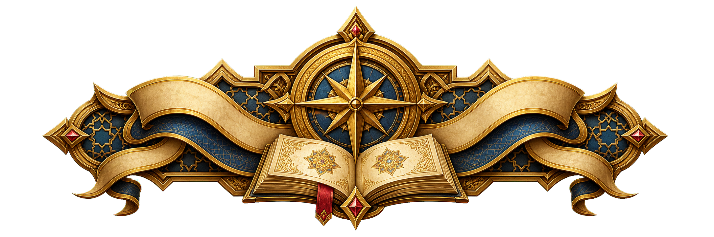
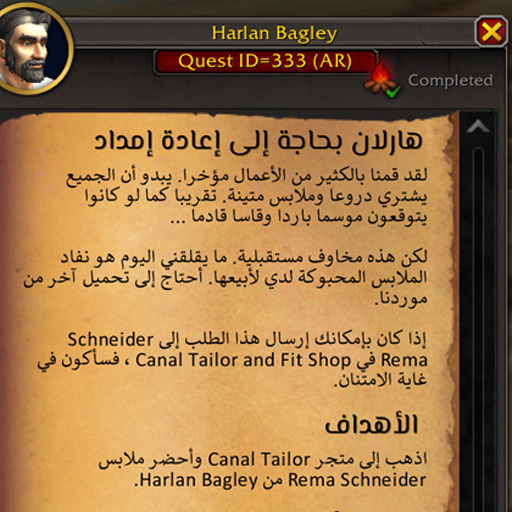
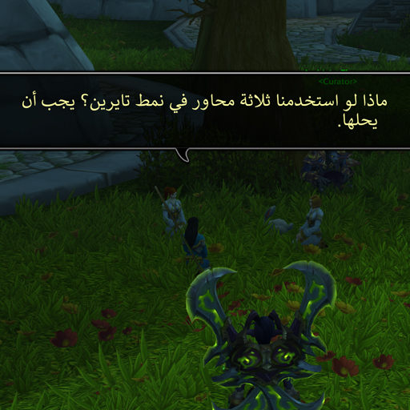
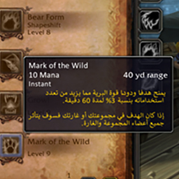

<p align="center" dir="rtl">
  
</p>

<h1 align="center">WoWAR</h1>

<p align="center" dir="rtl">
  <strong>عِش عالم ووركرافت بالعربية — من الحوارات والمهام إلى الواجهات والترجمة السينمائية.</strong>
</p>

<p align="center" dir="rtl">
  إضافة عربية مجتمعية تهتم بجودة القراءة من اليمين إلى اليسار، وسلامة النصوص المختلطة، وتقديم تجربة لعب عربية متكاملة قدر الإمكان.
</p>

<p align="center" dir="rtl">
  <a href="https://github.com/DiNaSoR/WoWAR/releases">
    
  </a>
  <a href="https://github.com/DiNaSoR/WoWAR/stargazers">
    
  </a>
  
  
</p>

<p align="center" dir="rtl">
  <a href="https://www.wowar.co">الموقع الرسمي</a>
  ·
  <a href="https://github.com/DiNaSoR/WoWAR/releases">التنزيل من GitHub</a>
  ·
  <a href="https://www.curseforge.com/wow/addons/wowar-arabic">CurseForge</a>
  ·
  <a href="https://discord.gg/uW5NJ6y">Discord</a>
</p>

---

<div dir="rtl" lang="ar">

## ما هي WoWAR؟

**WoWAR** إضافة لـ World of Warcraft تنقل أجزاء واسعة من تجربة اللعبة إلى العربية، مع محرك مخصص لمعالجة اتجاه النص وتشكيل الحروف والمحافظة على الأرقام والأسماء الإنجليزية وروابط الأدوات والأيقونات وألوان اللعبة.

ليست الفكرة مجرد استبدال النص الإنجليزي بترجمة عربية؛ بل جعل النص العربي قابلاً للقراءة داخل واجهة صُممت أصلاً للغات من اليسار إلى اليمين.

> [!IMPORTANT]
> تعمل الإضافة حالياً عند تشغيل اللعبة بواجهة إنجليزية `enUS` أو `enGB`. بعد تثبيتها، تتولى WoWAR عرض المحتوى المدعوم بالعربية داخل اللعبة.

## لماذا WoWAR مختلفة؟

| | الميزة | ما الذي تقدمه؟ |
| ---: | --- | --- |
| 🧭 | **محرك RTL مخصص** | تشكيل عربي، التفاف أسطر بحسب عرض الواجهة، ومحاذاة مناسبة للنصوص الطويلة |
| 🔀 | **نصوص مختلطة مستقرة** | الحفاظ على ترتيب الأرقام والأسماء الإنجليزية داخل الجمل العربية |
| 🧩 | **حماية أكواد WoW** | عدم كسر الألوان والأيقونات والأطالس والروابط والمتغيرات أثناء المعالجة |
| 📚 | **تغطية واسعة** | مهام، حوارات، فقاعات، تلميحات، كتب، دروس، أفلام، واجهات ودردشة |
| 🎛️ | **مركز تحكم حديث** | إعدادات منظمة مع بحث ومعاينات وخيارات منفصلة لكل نظام |
| 📝 | **التقاط النصوص الناقصة** | حفظ المحتوى غير المترجم داخل SavedVariables للمساعدة في توسيع قاعدة الترجمة |
| 🔌 | **تكاملات اختيارية** | دعم Immersion وStoryline وDialogueUI وClassic Quest Log |

## قاعدة ترجمة ضخمة

تتضمن النسخة الحالية أكثر من **238 ألف سجل ترجمة** موزعة على قواعد بيانات متخصصة:

<!-- Keep these counts synchronized with the *_base metadata in Translations/*.lua. Last verified 2026-07-31. -->

| المحتوى | عدد السجلات |
| --- | ---: |
| [فقاعات وحديث الشخصيات](Translations/Bubbles_AR_1.lua) | 132,350 |
| [حوارات الشخصيات](Translations/Gossip_AR.lua) | 58,244 |
| [المهام](Translations/QuestData_AR.lua) | 35,881 |
| [الأفلام والمشاهد السينمائية](Translations/Subtitles_AR.lua) | 5,351 |
| [الكتب](Translations/Books_AR.lua) | 4,425 |
| [الدروس والإرشادات](Translations/TutorialsData_AR.lua) | 2,363 |
| [تلميحات الأدوات](Translations/Tooltips_AR.lua) | 94 |
| **الإجمالي** | **238,708** |

## لمحة من داخل اللعبة

</div>

<table dir="rtl">
  <tr>
    <td align="center" width="33%">
      
      <br><strong>المهام والأهداف</strong>
    </td>
    <td align="center" width="33%">
      
      <br><strong>الحوارات وفقاعات الحديث</strong>
    </td>
    <td align="center" width="33%">
      
      <br><strong>تلميحات الأدوات</strong>
    </td>
  </tr>
</table>

<div dir="rtl" lang="ar">

## التثبيت

### الطريقة الأسرع

1. نزّل أحدث نسخة من [صفحة الإصدارات](https://github.com/DiNaSoR/WoWAR/releases) أو من [CurseForge](https://www.curseforge.com/wow/addons/wowar-arabic).
2. فك الضغط وانقل مجلد `WoWAR` إلى:

   ```text
   World of Warcraft\_retail_\Interface\AddOns\WoWAR
   ```

3. شغّل اللعبة باستخدام الواجهة الإنجليزية `enUS` أو `enGB`.
4. تأكد من تفعيل **WoWAR** من قائمة AddOns.
5. اكتب `/wowtr` أو اضغط أيقونة الخريطة المصغرة لفتح مركز التحكم.

> [!TIP]
> إذا لم تظهر الإضافة، تأكد أن المسار لا يحتوي على مجلد متداخل مثل `WoWAR\WoWAR\WoWAR.toc`، وأن ملف `WoWAR.toc` موجود مباشرة داخل مجلد الإضافة.

إذا كنت تستخدم نسخة أخرى معلنة في سطر `Interface` داخل ملف TOC، استبدل `_retail_` بمجلد نسخة اللعبة المقابل.

## أوامر مفيدة

| الأمر | الاستخدام |
| --- | --- |
| `/wowtr` | فتح مركز التحكم |
| `/reload` | إعادة تحميل واجهة اللعبة بعد التعديلات |
| `/wowardebug` | فتح أدوات التشخيص وجمع المعلومات عند الإبلاغ عن مشكلة |
| `/wowardebug preset <name>` | تشغيل إعداد تشخيصي قابل للتكرار |

## ما الذي تتم ترجمته؟

- نصوص المهام والعناوين والأهداف والمكافآت ومتعقب المهام.
- حوارات الشخصيات وخيارات Gossip.
- تلميحات الأدوات والعناصر والتعاويذ والمواهب وأجزاء مختارة من الواجهة.
- فقاعات الحديث وTalking Head ورسائل الشخصيات.
- الأفلام والمشاهد السينمائية والترجمات المصاحبة.
- الكتب والدروس والإرشادات داخل اللعبة.
- الدردشة العربية والخطوط المناسبة للنص العربي.
- واجهات إضافية اختيارية مثل Immersion وStoryline وDialogueUI وClassic Quest Log.

## كيف تعمل الإضافة؟

1. تُحمّل قواعد الترجمة من [`Translations/`](Translations) وفق ترتيب [`WoWAR.toc`](WoWAR.toc).
2. يبحث كل نظام عن الترجمة الموافقة للنص أو المعرّف الظاهر في اللعبة.
3. يوسّع [`common/Text.lua`](common/Text.lua) متغيرات اللاعب والجنس والعرق والفئة ويحمي أكواد WoW الخاصة.
4. يشكّل [`common/Text/Reshaper.lua`](common/Text/Reshaper.lua) النص العربي ويجهزه للعرض حسب عرض العنصر.
5. تطبق الوحدة المالكة الخط والمحاذاة والتخطيط المناسب، أو تعود إلى النص الإنجليزي الأصلي عند غياب الترجمة.
6. يمكن حفظ النصوص المفقودة في SavedVariables لتجهيزها للترجمة لاحقاً.

يحفظ AceDB الإعدادات الحديثة في `WOWTR_DB`، بينما يزامن [`LegacyBridge.lua`](common/Core/LegacyBridge.lua) القيم مع جداول التوافق القديمة التي ما زالت بعض الأنظمة تقرؤها.

## التوافق والإصدارات

- نسخة التطوير الحالية في [`WoWAR.toc`](WoWAR.toc): **12.04**.
- أرقام واجهات WoW المدعومة موثقة دائماً في سطر `Interface` داخل ملف TOC.
- الإضافة فعالة حالياً على عميل إنجليزي `enUS` أو `enGB`.
- البناء المعتاد لا يحتاج إلى مترجم أو حزمة JavaScript؛ يحمّل WoW ملفات Lua وXML والأصول مباشرة.

## للمطورين والمساهمين

```text
WoWAR.toc               بيان الإضافة وترتيب التحميل
common/Core/            التهيئة والأحداث والتوافق والتشخيص
common/Config/          الإعدادات وAceDB ومركز التحكم
common/Quests/          المهام والحوارات والمتعقب
common/Tooltips/        التلميحات والخطوط والخطافات
common/Text.lua         توسيع النص وحماية أكواد WoW
common/Text/Reshaper.lua تشكيل العربية وتجهيز أسطر RTL
common/RTL.lua          اتجاه الواجهة ومساعدات المحاذاة
Translations/          قواعد بيانات الترجمة العربية
Docs/                  التوثيق الهندسي وخطط الاختبار
```

ابدأ من [دليل المساهمة](CONTRIBUTING.md)، ثم راجع [فهرس التوثيق](Docs/README.md). أكثر المساهمات فائدة:

- إضافة ترجمات عربية أو تصحيحها.
- معالجة حالات RTL والنصوص المختلطة والأرقام والرموز.
- اختبار تغييرات واجهة Blizzard بعد تحديثات اللعبة.
- تحسين تكاملات Immersion وStoryline وDialogueUI وغيرها.
- توثيق خطوات قابلة للتكرار وإضافة أدلة مرئية للمشكلات.

### التوثيق التقني

- [معمارية المشروع](Docs/Architecture.md)
- [إرشادات التطوير](Docs/EngineeringGuidelines.md)
- [الإعدادات وLegacyBridge](Docs/ConfigSettingsAudit.md)
- [محرك النص العربي وQTR_ExpandUnitInfo](Docs/QTR_ExpandUnitInfo_RTL_Bidi_Implementation_Prompt.md)
- [خطة اختبارات الانحدار](Docs/RegressionTesting.md)
- [سجل التغييرات](CHANGELOG.md)

## الإبلاغ عن مشكلة

عند فتح بلاغ، أرفق:

- إصدار WoW ورقم `Interface`.
- إصدار WoWAR.
- اللغة المستخدمة: `enUS` أو `enGB`.
- أسماء إضافات الواجهة الأخرى المفعلة.
- الشاشة أو المهمة أو الشخصية التي ظهرت فيها المشكلة.
- لقطة شاشة، ورسالة الخطأ أو ناتج `/wowardebug` إن توفر.

يمكنك استخدام [GitHub Issues](https://github.com/DiNaSoR/WoWAR/issues) أو الانضمام إلى [Discord](https://discord.gg/uW5NJ6y).

## الفريق

صُنعت WoWAR وجرى تطويرها بواسطة:

- **Dragonarab (DiNaSoR)**
- **Platine**
- وكل من ساهم بترجمة أو اختبار أو بلاغ مفيد.

إذا أفادتك الإضافة، يمكنك دعم المشروع بنجمة ⭐، مشاركة رابطها، أو المساهمة في تحسين الترجمة.

> [!NOTE]
> WoWAR مشروع مجتمعي غير رسمي. لا يوجد ملف `LICENSE` في المستودع حتى الآن؛ إتاحة المصدر للمشاهدة لا تمنح تلقائياً حقوق إعادة الاستخدام أو إعادة التوزيع. تواصل مع أصحاب المشروع عند الحاجة إلى إذن واضح.

</div>

---

<p align="center" dir="rtl">
  <strong>من أزيروث إلى العالم العربي — كلمةً كلمة.</strong>
</p>
